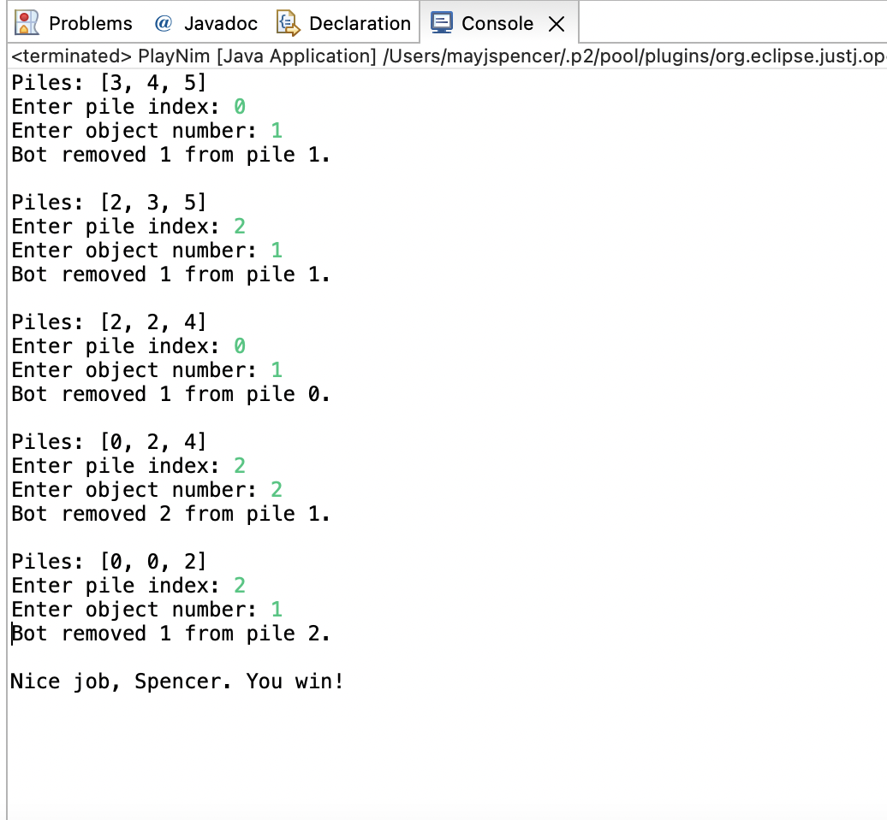

# Nim with Polymorphic Players

This is a Java-based command-line implementation of the classic strategy game [Nim](https://en.wikipedia.org/wiki/Nim). The project demonstrates core object-oriented programming (OOP) concepts, custom exception handling, and user interaction via CLI.

## Game Overview

Nim is an ancient two-player game involving several piles of identical objects. Players take turns removing **one or more objects** from a **single pile**. The player forced to take the last object **loses**.

Typical starting configurations include pile sizes such as `3-4-5` or `1-3-5-7`.

Outwit your opponent (a human or AI) by leaving them with no winning moves.

## Features

- Object-Oriented Design using `Player`, `HumanPlayer`, `RandomPlayer`, `Piles`, and `Nim` classes
- Custom exception handling with `IllegalMoveException`
- Clear game flow with input validation and detailed error messages
- Abstract base class (`Player`) with polymorphic behavior
- Basic AI opponent using randomized valid moves
- CLI input/output via `Scanner`
- UML diagrams included for learning and documentation

## How to Run

1. Clone the repo:
   ```bash
   git clone https://github.com/mayjspencer/Nim-Game-Project.git
   cd Nim-Game-Project
   ```
   
2. Compile all Java files:
    ```bash
    javac *.java
    ```

3. Run the game:
    ```bash
    java Nim
    ```
## Sample Gameplay


## Error Handling
Custom exception IllegalMoveException is thrown for:
- Invalid pile index
- Removing more objects than available
- Negative or zero object requests
- Empty pile access
- This helps enforce the rules and improve resilience of the CLI game experience.

## Author

Spencer May
University of Oklahoma Graduate - Computer Science | Oklahoma City | GitHub Profile


## Details About The Game of Nim

[Nim](https://en.wikipedia.org/wiki/Nim) is an ancient two-player strategy game that is played with a collection of identical objects organized into piles.
The number and sizes of the piles can change from game to game, but 3-4-5 and 1-3-5-7 are commonly used.
Players take turns removing one or more objects from any single pile until none remain.
The loser is the player that removes the last object.

Below is example output from the game in which the human beats the computer opponent, RandomPlayer.

```text
Piles: [3, 4, 5]
Enter pile index: 0
Enter object number: 2
RandomPlayer removed 3 from pile 2.

Piles: [1, 4, 2]
Enter pile index: 1
Enter object number: 1q
Enter object number: 1
RandomPlayer removed 1 from pile 0.

Piles: [0, 3, 2]
Enter pile index: 1
Enter object number: 0
Nonpositive object number: 0

Piles: [0, 3, 2]
Enter pile index: 1
Enter object number: 1
RandomPlayer removed 2 from pile 2.

Piles: [0, 2, 0]
Enter pile index: 1
Enter object number: 1
RandomPlayer removed 1 from pile 1.

Nice job, Spencer. You win!
```

### Program Overview

The structure of the program is shown in the UML diagram.
The Nim class uses the Player and Piles classes to simulate a game of Nim.
Each Nim object contains two Player objects and one Piles object.

The Player class is abstract.
It has one abstract method, getMove, that is overridden in its two non-abstract (concrete) subclasses: RandomPlayer and HumanPlayer.

### Custom Exception Class

The `IllegalMoveException` is a custom exception class in the Nim game. It extends the standard Java exception class and is specifically designed to be thrown when an illegal move is detected within the `Piles` class.

In the Nim game context, an illegal move could be any move that violates the rules of the game, such as trying to remove objects from a pile that doesn't exist, attempting to remove a negative number of objects, or trying to remove more objects than are present in a pile.

By throwing this custom exception, the `Piles` class signals that an error related to an illegal move has occurred. This allows the game to catch and handle this exception, providing a mechanism for the program to recover from invalid user input and prompt the user for a different, valid move.

In summary, `IllegalMoveException` serves as a means of indicating and handling errors related to illegal moves within the Nim game, contributing to the resilience of the game's behavior when faced with unexpected or invalid user input.

### Piles Class

Piles represents the piles of identical objects in a game of Nim.
The class encapsulates the pile sizes and throws exceptions to enforce the rules of the game.

* `Piles(int... initSizes)`: Initialize a new Piles object with the sizes in the given array.

  The constructor should throw an IllegalArgumentException if either of the following conditions is true:

  1. The array reference is null or the array has zero length.
  2. Any element of the array is not positive.
  (None of the piles can initially be empty.)

* `getSizes()`: Return an array with the current pile sizes.

* `removeObjects(int[] move)`: Remove objects from one of the piles.
The input is a two-element array that represents a player's move.
The array has the format [index, number].
The first element is the index of one of the piles.
The second element is the number of objects to remove.


  1. If the array reference is null, throw an IllegalMoveException with the message `"null move"`.

  2. If the array has a length other than 2, use the message `"Invalid length: <length>"`.

  3. If the pile index is out of bounds, use the message `"Index out of bounds: <index>"`.

  4. If the pile has a size of 0, use the message `"Pile <index> is empty."`.

  5. If the object number is less than or equal to 0, use the message `"Nonpositive object number: <number>"`.

  6. If the object number is greater than the pile size, use the message `"Object number greater than pile size: <number> > <size>"`.

### Player Class

The abstract Player class provides a common set of methods that the Nim class uses to interact with all Player subclasses.
The most important of these is the abstract method getMove, which must be overridden by any non-abstract subclass.
This method takes an array of pile sizes and returns a two-element array that represents a player's move.
The move array has the same format described in the previous section: [pile index, object number].

The remaining Player methods are all non-abstract.
Most of them are used by Nim to notify a player that something important has happened (e.g., they've won the game).
Subclasses of Player can choose to override these methods to implement special behavior.
For example, HumanPlayer uses these methods to print information to the console.

### RandomPlayer Class

RandomPlayer is a subclass of Player that makes choices with a [random number generator].
It does not override any of the non-abstract Player methods.

* `RandomPlayer(String name)`: Pass the name to the parent constructor and initialize the generator field by calling the [no-argument Random constructor]

* `getMove(int[] pileSizes)`: Return a random legal move.

### HumanPlayer Class

HumanPlayer is a subclass of Player that gets moves from the user via the keyboard and prints information about the game to the console.

* `getUserInput(String prompt)`: Read and return an integer input by the user.

  The method should perform the following steps:

  1. Print the given String to System.out without a trailing newline character.
  2. Read and return an integer using the Scanner (the keyboard field).
  3. If the Scanner throws an InputMismatchException, catch it and call nextLine to get rid of the invalid input.
  4. Loop back to step 1.

### Nim Class

The Nim class uses the Piles and Player classes to simulate a game of Nim.

* `takeTurn()`: Get the next move from the current player and apply it to the piles.
If the move is legal, notify the waiting player.
If the move is illegal, notify the current player and ask for another move.

  The method should perform the following steps:

  1. Get a move from the current player.
  2. Try to remove the specified number of objects from the piles.
  3. If the move is successful, notify the waiting player by calling notifyOpponentMove and passing it the current player's name and move.
  Then return.
  4. If the Piles object throws an IllegalMoveException, catch it and notify the current player by calling notifyIllegalMove and passing it the exception message.
  5. Loop back to step 1.
